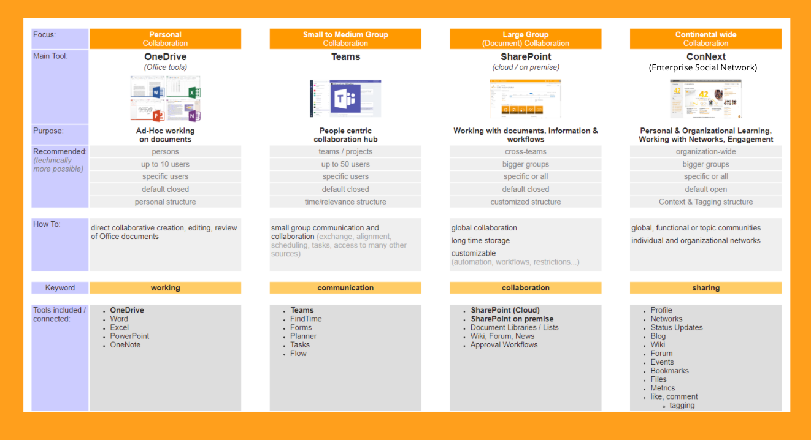

## Fallbeispiel: Continental

In diesem Fallbeispiel wird die Continental IT Collaboration-Systemlandschaft erklärt.

### Continental Case Study

In unserer Organisation nutzen wir eine ganzheitliche IT Collaboration-Systemlandschaft, die sich in die nachfolgenden vier Nutzungssäulen einteilt als digitales Ökosystem:

Orientierungsaufgabe:

Nutzt diese vier Nutzungssäulen und ordnet Eure verfügbaren Tools für Kommunikation und Zusammenarbeit in Eurem Kontext (z.B. für Eure Abteilung, Euer Projekt-Team oder die gesamte Organisation) zu. Dazu kann Euch das nachfolgende Template unten weiterhelfen. Reflektiert die jeweiligen Vor- und Nachteile in ihrer jeweiligen Anwendung. *

- *Beispiel 1 - Teams: Wenn Ihr versucht, Teams für die organisationsweite Kommunikation und Zusammenarbeit zu verwenden, werdet Ihr die Leute überlasten (außer dass es nur als Newsletter verwendet wird -- wofür es nicht gedacht ist.

- *Beispiel 2 - Enterprise Social Network (ESN): in reines Social Communication Tool (Yammer) hat keine Zusammenarbeitsfunktionen, da es vor Allem für Marketing und Kommunikation gemacht ist

**Hinweis**: Bedenke die Anzahl der möglichen (sinnvollen) maximalen Teilgebenden einer Anwendung (z.B. Whiteboard) oder z.B. einen persönlichen Cloud-Speicher "allen" teilst (was beim verlassen der Organisation verloren geht)
